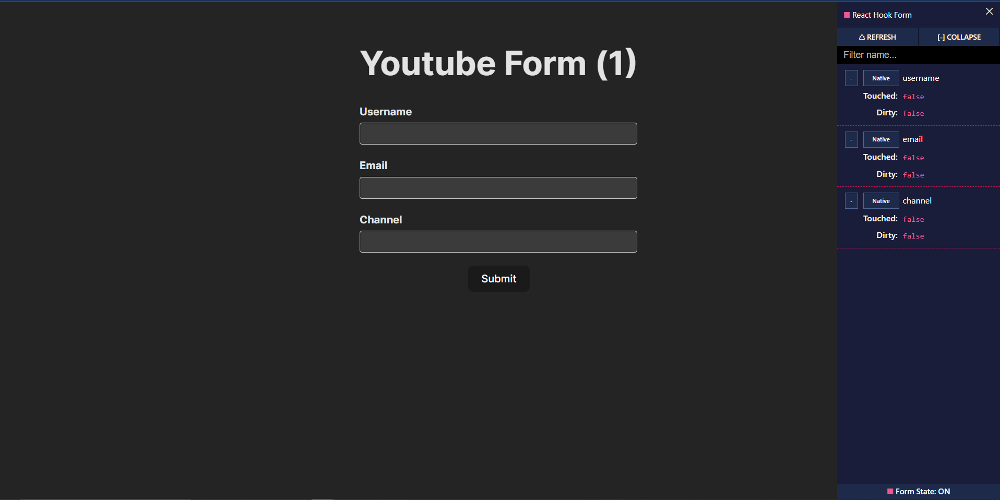
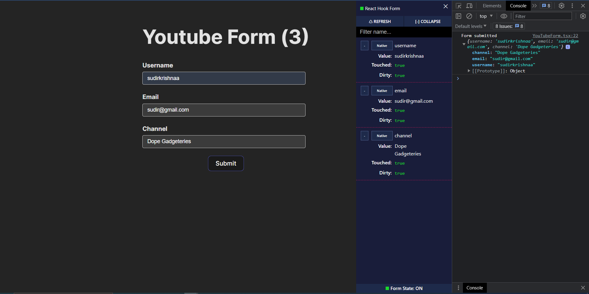
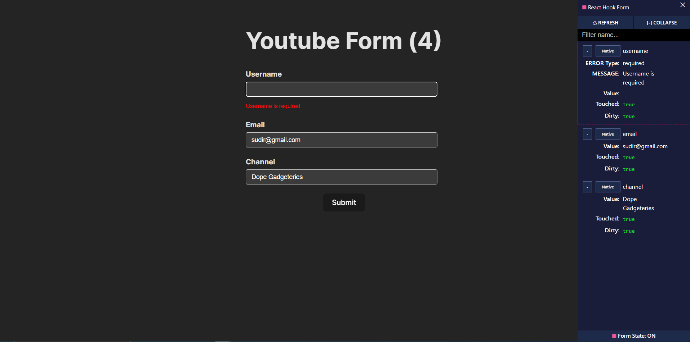
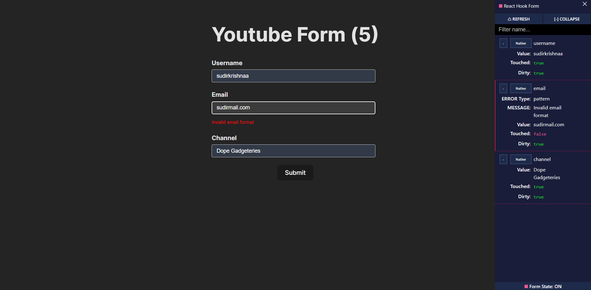
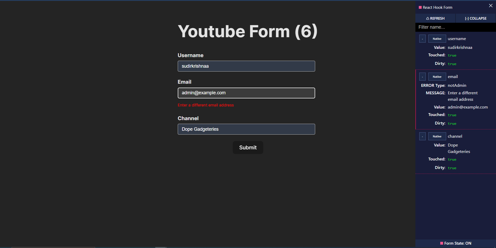
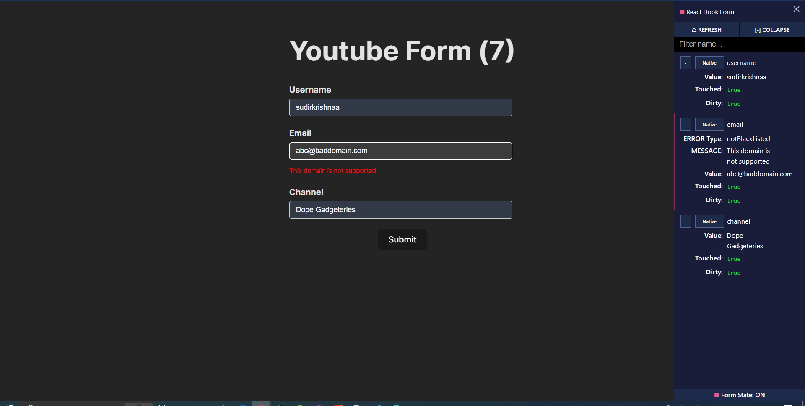

# YouTube Form Summary(Notes)

What all has been implemented on `YouTubeForm.tsx` file are :

## OUTPUT:

## On Submit:

## Feild Validations:

1. `Username` Feild :

   - Validation : Required feild
     

2. `Email` Feild :

   - Validation : Follows General email format (using RegEx)
     

   - Validation : Custom validation

     It checks if the value of the email field is not equal to "admin@example.com".
     - If it is equal to "admin@example.com", it returns the error message "Enter a different email address".
     - If it is not equal to "admin@example.com", it returns true, indicating that the validation has passed.

   

   - Validation : Custom validation

     It checks if the email address entered by the user does not end with "baddomain.com". 
     - If it does not end with "baddomain.com", the validation passes and returns true. 
     - If it ends with "baddomain.com", the validation fails and returns the error message "This domain is not supported".

     

